### kubernetes从安装到卸载

#### 1.安装 gcc

```shell
yum -y install gcc
yum -y install gcc-c++
```

#### 2.卸载旧版本 docker

```shell
yum remove docker \
                  docker-client \
                  docker-client-latest \
                  docker-common \
                  docker-latest \
                  docker-latest-logrotate \
                  docker-logrotate \
                  docker-engine
```

#### 3.安装 yum-utils软件包

```shell
yum install -y yum-utils
```

#### 4.设置镜像仓库源

```shell
yum-config-manager --add-repo https://download.docker.com/linux/centos/docker-ce.repo
    
yum-config-manager --add-repo http://mirrors.aliyun.com/docker-ce/linux/centos/docker-ce.repo
```

#### 5.更新yum 索引

```shell
yum clean all
yum makecache fast
yum update --allowerasing 
```

#### 6.安装 docker-ce

```shell
yum install -y docker-ce docker-ce-cli containerd.io
```

#### 7.安装 k8s

```shell
cat <<EOF | sudo tee /etc/yum.repos.d/kubernetes.repo
[kubernetes]
name=Kubernetes
baseurl=https://mirrors.aliyun.com/kubernetes/yum/repos/kubernetes-el7-x86_64
enabled=1
gpgcheck=1
repo_gpgcheck=0
gpgkey=https://mirrors.aliyun.com/kubernetes/yum/doc/yum-key.gpg https://mirrors.aliyun.com/kubernetes/yum/doc/rpm-package-key.gpg
exclude=kubelet kubeadm kubectl
EOF

# 将 SELinux 设置为 permissive 模式（相当于将其禁用）
setenforce 0
sed -i 's/^SELINUX=enforcing$/SELINUX=permissive/' /etc/selinux/config
swapoff -a

#允许 iptables 检查桥接流量
cat <<EOF | sudo tee /etc/modules-load.d/k8s.conf
br_netfilter
EOF

cat <<EOF | sudo tee /etc/sysctl.d/k8s.conf
net.bridge.bridge-nf-call-ip6tables = 1
net.bridge.bridge-nf-call-iptables = 1
EOF
sudo sysctl --system
#install kubelet kubeadm kubectl
yum install -y kubelet kubeadm kubectl --disableexcludes=kubernetes

kubeadm config images list

yum install -y kubelet-1.23.4 kubeadm-1.23.4 kubectl-1.23.4 --disableexcludes=kubernetes

systemctl enable --now kubelet
#修改 docker cgroup 驱动为systemd
mkdir /etc/docker
cat > /etc/docker/daemon.json <<EOF
{
  "exec-opts": ["native.cgroupdriver=systemd"],
  "log-driver": "json-file",
  "log-opts": {
    "max-size": "100m"
  },
  "storage-driver": "overlay2",
  "storage-opts": [
    "overlay2.override_kernel_check=true"
  ],
  "insecure-registries":["reg.secsmart.com.cn"],
  "data-root": "/data/docker"
}
EOF
systemctl daemon-reload
systemctl restart docker

#修改hostsname
echo '172.16.39.202 k8s-master' >> /etc/hosts
echo '172.16.49.20 k8s-node1' >> /etc/hosts
echo '172.16.49.21 k8s-node2' >> /etc/hosts
echo '172.16.53.161 k8s-node3' >> /etc/hosts
echo '172.16.53.160 reg.secsmart.com.cn' >> /etc/hosts
systemctl stop firewalld && systemctl disable firewalld


kubeadm init \
--apiserver-advertise-address=172.16.39.202 \
--image-repository registry.aliyuncs.com/google_containers \
--kubernetes-version v1.23.4 \
--service-cidr=10.1.0.0/16,2000:db8:42:1::/108 \
--pod-network-cidr=192.168.0.0/16,2001:db8:42:0::/64

kubeadm init --pod-network-cidr=10.244.0.0/16,2001:db8:42:0::/56 --service-cidr=10.96.0.0/16,2001:db8:42:1::/112
#podnetwork
Run "kubectl apply -f [podnetwork].yaml" with one of the options listed at:
https://kubernetes.io/docs/concepts/cluster-administration/addons/

#kubeadm init报错
[ERROR FileContent--proc-sys-net-bridge-bridge-nf-call-iptables]: /proc/sys/net/bridge/bridge-nf-call-iptables does not exist
#解决办法
vi /etc/sysctl.conf

在/etc/sysctl.conf中添加：

net.bridge.bridge-nf-call-ip6tables = 1
net.bridge.bridge-nf-call-iptables = 1

#保存后执行 sysctl -p
sysctl: cannot stat /proc/sys/net/bridge/bridge-nf-call-ip6tables: No such file or directory
sysctl: cannot stat /proc/sys/net/bridge/bridge-nf-call-iptables: No such file or directory

#报错信息如上执行 modprobe br_netfilter
#在执行 sysctl -p
net.bridge.bridge-nf-call-ip6tables = 1
net.bridge.bridge-nf-call-iptables = 1

#kubeadm init报错
[ERROR FileContent--proc-sys-net-ipv4-ip_forward]: /proc/sys/net/ipv4/ip_forward contents are not set to 1
#解决办法
sysctl -w net.ipv4.ip_forward=1

#要使非 root 用户可以运行 kubectl，请运行以下命令， 它们也是 kubeadm init 输出的一部分：
rm -rf $HOME/.kube
mkdir -p $HOME/.kube
sudo cp -i /etc/kubernetes/admin.conf $HOME/.kube/config
sudo chown $(id -u):$(id -g) $HOME/.kube/config
#如果你是 root 用户，则可以运行：
export KUBECONFIG=/etc/kubernetes/admin.conf

kubectl apply -f https://raw.githubusercontent.com/flannel-io/flannel/master/Documentation/kube-flannel.yml

kubeadm join 172.16.39.202:6443 --token djq1fd.iuun2whpgz166n4t \
	--discovery-token-ca-cert-hash sha256:27325aa2364549db96da506015a396394d4fe100ff5559ead246d1ec8758efe2

#kubeadm join 报错
kubeadm join命令，将node加入master时，出现error execution phase preflight: couldn't validate the identity of the API Server: abort connecting to API servers after timeout
[preflight] Running pre-flight checks
error execution phase preflight: couldn't validate the identity of the API Server: Get "https://172.16.39.202:6443/api/v1/namespaces/kube-public/configmaps/cluster-info?timeout=10s": x509: certificate has expired or is not yet valid:
#解决：重新生成新token
# kubeadm token create
4lmxeo.ed85xnxdcy44l741
# openssl x509 -pubkey -in /etc/kubernetes/pki/ca.crt | openssl rsa -pubin -outform der 2>/dev/null | openssl dgst -sha256 -hex | sed 's/^.* //'
a04299cfdc941c8ccb2377b494b73688a2cbdefc7e1cc57b7a1edd6c87edb815
kubeadm join 172.16.39.202:6443 --token 4lmxeo.ed85xnxdcy44l741 \
	--discovery-token-ca-cert-hash sha256:a04299cfdc941c8ccb2377b494b73688a2cbdefc7e1cc57b7a1edd6c87edb815


kubectl label nodes k8s-node1 node-role.kubernetes.io/worker=
kubectl label nodes k8s-node2 node-role.kubernetes.io/worker=
kubectl label nodes k8s-node3 node-role.kubernetes.io/worker=

kubectl apply -f kube-flannel.yml

#启用 shell 自动补全功能
yum install bash-completion
#上述命令将创建文件 /usr/share/bash-completion/bash_completion，它是 bash-completion 的主脚本。 依据包管理工具的实际情况，你需要在 ~/.bashrc 文件中手工导入此文件。要查看结果，请重新加载你的 shell，并运行命令 
type _init_completion
#如果命令执行成功，则设置完成，否则将下面内容添加到文件 ~/.bashrc 中：
source /usr/share/bash-completion/bash_completion
#重新加载 shell，再输入命令 type _init_completion 来验证 bash-completion 的安装状态。

#启动 kubectl 自动补全功能
#在文件 ~/.bashrc 中导入（source）补全脚本
echo 'source <(kubectl completion bash)' >>~/.bashrc
#或者将补全脚本添加到目录 /etc/bash_completion.d 中
kubectl completion bash >/etc/bash_completion.d/kubectl

#如果 kubectl 有关联的别名，你可以扩展 shell 补全来适配此别名
echo 'alias k=kubectl' >>~/.bashrc
echo 'complete -F __start_kubectl k' >>~/.bashrc
```

#### 8.卸载 k8s

```shell
# 适当的凭证与控制平面节点通信，运行：
kubectl drain <node name> --delete-local-data --force --ignore-daemonsets
# 卸载服务
kubeadm reset
# 重置过程不会重置或清除 iptables 规则或 IPVS 表。如果你希望重置 iptables，则必须手动进行：
iptables -F && iptables -t nat -F && iptables -t mangle -F && iptables -X
# 如果要重置 IPVS 表，则必须运行以下命令：
ipvsadm -C
# 现在删除节点：
kubectl delete node <node name>
# 删除rpm包
rpm -qa|grep kube*|xargs rpm --nodeps -e
```

#### 9.安装harbor

1.下载安装包

```shell
wget https://github.com/goharbor/harbor/releases/download/v2.5.0-rc3/harbor-offline-installer-v2.5.0-rc3.tgz
```

2.安装 docker && docker-compose

```shell
sudo curl -L "https://github.com/docker/compose/releases/download/1.29.2/docker-compose-$(uname -s)-$(uname -m)" -o /usr/local/bin/docker-compose
sudo chmod +x /usr/local/bin/docker-compose
sudo ln -s /usr/local/bin/docker-compose /usr/bin/docker-compose
docker-compose --version
```

3.配置证书

```shell
#生成证书颁发机构证书
#1.生成CA证书私钥。
openssl genrsa -out ca.key 4096
#2.生成CA证书。
openssl req -x509 -new -nodes -sha512 -days 3650 \
 -subj "/C=CN/ST=Beijing/L=Beijing/O=example/OU=Personal/CN=yourdomain.com.cn" \
 -key ca.key \
 -out ca.crt
 
#生成服务器证书
#1.生成私钥。
openssl genrsa -out secsmart.com.cn.key 4096
#2.生成证书签名请求 (CSR)。
openssl req -sha512 -new -subj "/C=CN/ST=ZheJiang/L=HangZhou/O=secsmart/OU=networkdlp/CN=reg.secsmart.com.cn" -key secsmart.com.cn.key -out secsmart.com.cn.csr
#3.生成一个x509 v3扩展名文件。
cat > v3.ext <<-EOF
authorityKeyIdentifier=keyid,issuer
basicConstraints=CA:FALSE
keyUsage = digitalSignature, nonRepudiation, keyEncipherment, dataEncipherment
extendedKeyUsage = serverAuth
subjectAltName = @alt_names

[alt_names]
DNS.1=secsmart.com.cn
DNS.2=secsmart.com
DNS.3=secsmart
DNS.4=hostname
EOF
#4.使用v3.ext文件为您的Harbor主机生成证书。
openssl x509 -req -sha512 -days 3650 \
    -extfile v3.ext \
    -CA ca.crt -CAkey ca.key -CAcreateserial \
    -in secsmart.com.cn.csr \
    -out secsmart.com.cn.crt
```

4.向Harbor和Docker提供证书

```shell
#1.将服务器证书和密钥复制到Harbor主机上的certficates文件夹中。
cp secsmart.com.cn.crt /data/cert/
cp secsmart.com.cn.key /data/cert/
#2.将yourdomain.com.crt转换为yourdomain.com.cert，供Docker使用
openssl x509 -inform PEM -in secsmart.com.cn.crt -out secsmart.com.cn.cert
#3.将服务器证书、密钥和CA文件复制到Harbor主机上的Docker证书文件夹中。您必须先创建相应的文件夹。
cp secsmart.com.cn.cert /etc/docker/certs.d/secsmart.com.cn/
cp secsmart.com.cn.key /etc/docker/certs.d/secsmart.com.cn/
cp ca.crt /etc/docker/certs.d/secsmart.com.cn/
#如果您将默认nginx端口443映射到其他端口，请创建文件夹/etc/docker/certs.d/yourdomain.com:port或/etc/docker/certs.d/harbor_IP:port。
#4.重新启动Docker引擎。
systemctl restart docker
```

### kubernetes基础

#### 1.Kubernetes 是什么？

​		Kubernetes 是一个可移植、可扩展的开源平台，用于管理容器化的工作负载和服务，可促进声明式配置和自动化。 Kubernetes 拥有一个庞大且快速增长的生态系统，其服务、支持和工具的使用范围广泛。

​		Kubernetes 这个名字源于希腊语，意为“舵手”或“飞行员”。k8s 这个缩写是因为 k 和 s 之间有八个字符的关系。 Google 在 2014 年开源了 Kubernetes 项目。Kubernetes 建立在 [Google 大规模运行生产工作负载十几年经验](https://research.google/pubs/pub43438)的基础上，结合了社区中最优秀的想法和实践。


**传统部署时代：**

早期，各个组织机构在物理服务器上运行应用程序。无法为物理服务器中的应用程序定义资源边界，这会导致资源分配问题。 例如，如果在物理服务器上运行多个应用程序，则可能会出现一个应用程序占用大部分资源的情况， 结果可能导致其他应用程序的性能下降。 一种解决方案是在不同的物理服务器上运行每个应用程序，但是由于资源利用不足而无法扩展， 并且维护许多物理服务器的成本很高。

**虚拟化部署时代：**

作为解决方案，引入了虚拟化。虚拟化技术允许你在单个物理服务器的 CPU 上运行多个虚拟机（VM）。 虚拟化允许应用程序在 VM 之间隔离，并提供一定程度的安全，因为一个应用程序的信息 不能被另一应用程序随意访问。

虚拟化技术能够更好地利用物理服务器上的资源，并且因为可轻松地添加或更新应用程序 而可以实现更好的可伸缩性，降低硬件成本等等。

每个 VM 是一台完整的计算机，在虚拟化硬件之上运行所有组件，包括其自己的操作系统。

**容器部署时代：**

容器类似于 VM，但是它们具有被放宽的隔离属性，可以在应用程序之间共享操作系统（OS）。 因此，容器被认为是轻量级的。容器与 VM 类似，具有自己的文件系统、CPU、内存、进程空间等。 由于它们与基础架构分离，因此可以跨云和 OS 发行版本进行移植。

容器因具有许多优势而变得流行起来。下面列出的是容器的一些好处：

- **敏捷应用程序的创建和部署**：与使用 VM 镜像相比，提高了容器镜像创建的简便性和效率。
- **持续开发、集成和部署**：通过快速简单的回滚（由于镜像不可变性），支持可靠且频繁的 容器镜像构建和部署。
- **关注开发与运维的分离**：在构建/发布时而不是在部署时创建应用程序容器镜像， 从而将应用程序与基础架构分离。
- **可观察性**：不仅可以显示操作系统级别的信息和指标，还可以显示应用程序的运行状况和其他指标信号。
- **跨开发、测试和生产的环境一致性**：在便携式计算机上与在云中相同地运行。
- **跨云和操作系统发行版本的可移植性**：可在 Ubuntu、RHEL、CoreOS、本地、 Google Kubernetes Engine 和其他任何地方运行。
- **以应用程序为中心的管理**：提高抽象级别，从在虚拟硬件上运行 OS 到使用逻辑资源在 OS 上运行应用程序。
- **松散耦合、分布式、弹性、解放的微服务**：应用程序被分解成较小的独立部分， 并且可以动态部署和管理 - 而不是在一台大型单机上整体运行。
- **资源隔离**：可预测的应用程序性能。
- **资源利用**：高效率和高密度。

#### 2.为什么需要 Kubernetes，它能做什么? 

容器是打包和运行应用程序的好方式。在生产环境中，你需要管理运行应用程序的容器，并确保不会停机。 例如，如果一个容器发生故障，则需要启动另一个容器。如果系统处理此行为，会不会更容易？

这就是 Kubernetes 来解决这些问题的方法！ Kubernetes 为你提供了一个可弹性运行分布式系统的框架。 Kubernetes 会满足你的扩展要求、故障转移、部署模式等。 例如，Kubernetes 可以轻松管理系统的 Canary 部署。

Kubernetes 为你提供：

- **服务发现和负载均衡**

  Kubernetes 可以使用 DNS 名称或自己的 IP 地址公开容器，如果进入容器的流量很大， Kubernetes 可以负载均衡并分配网络流量，从而使部署稳定。

- **存储编排**

  Kubernetes 允许你自动挂载你选择的存储系统，例如本地存储、公共云提供商等。

- **自动部署和回滚**

  你可以使用 Kubernetes 描述已部署容器的所需状态，它可以以受控的速率将实际状态 更改为期望状态。例如，你可以自动化 Kubernetes 来为你的部署创建新容器， 删除现有容器并将它们的所有资源用于新容器。

- **自动完成装箱计算**

  Kubernetes 允许你指定每个容器所需 CPU 和内存（RAM）。 当容器指定了资源请求时，Kubernetes 可以做出更好的决策来管理容器的资源。

- **自我修复**

  Kubernetes 重新启动失败的容器、替换容器、杀死不响应用户定义的 运行状况检查的容器，并且在准备好服务之前不将其通告给客户端。

- **密钥与配置管理**

  Kubernetes 允许你存储和管理敏感信息，例如密码、OAuth 令牌和 ssh 密钥。 你可以在不重建容器镜像的情况下部署和更新密钥和应用程序配置，也无需在堆栈配置中暴露密钥。

Kubernetes 不是传统的、包罗万象的 PaaS（平台即服务）系统。 由于 Kubernetes 在容器级别而不是在硬件级别运行，它提供了 PaaS 产品共有的一些普遍适用的功能， 例如部署、扩展、负载均衡、日志记录和监视。 但是，Kubernetes 不是单体系统，默认解决方案都是可选和可插拔的。 Kubernetes 提供了构建开发人员平台的基础，但是在重要的地方保留了用户的选择和灵活性。

- 不限制支持的应用程序类型。 Kubernetes 旨在支持极其多种多样的工作负载，包括无状态、有状态和数据处理工作负载。 如果应用程序可以在容器中运行，那么它应该可以在 Kubernetes 上很好地运行。
- 不部署源代码，也不构建你的应用程序。 持续集成（CI）、交付和部署（CI/CD）工作流取决于组织的文化和偏好以及技术要求。
- 不提供应用程序级别的服务作为内置服务，例如中间件（例如，消息中间件）、 数据处理框架（例如，Spark）、数据库（例如，MySQL）、缓存、集群存储系统 （例如，Ceph）。这样的组件可以在 Kubernetes 上运行，并且/或者可以由运行在 Kubernetes 上的应用程序通过可移植机制（例如， [开放服务代理](https://openservicebrokerapi.org/)）来访问。

- 不要求日志记录、监视或警报解决方案。 它提供了一些集成作为概念证明，并提供了收集和导出指标的机制。
- 不提供或不要求配置语言/系统（例如 jsonnet），它提供了声明性 API， 该声明性 API 可以由任意形式的声明性规范所构成。
- 不提供也不采用任何全面的机器配置、维护、管理或自我修复系统。
- 此外，Kubernetes 不仅仅是一个编排系统，实际上它消除了编排的需要。 编排的技术定义是执行已定义的工作流程：首先执行 A，然后执行 B，再执行 C。 相比之下，Kubernetes 包含一组独立的、可组合的控制过程， 这些过程连续地将当前状态驱动到所提供的所需状态。 如何从 A 到 C 的方式无关紧要，也不需要集中控制，这使得系统更易于使用 且功能更强大、系统更健壮、更为弹性和可扩展。

#### 3.命令式（Imperative）vs声明式（Declarative)

- **命令式系统关注"如何做"**

在软件工程领域，命令式系统是写出解决某个问题、完成某个任务或者达到某个目标的明确步骤。此方法明确写出系统应该执行某指令，并且期待系统返回期望结果。

- **声明式系统关注"做什么"**

在软件工程领域，声明式系统指程序代码描述系统应该做什么而不是怎么做。仅限于描述要达到什么目的，如何达到目的交给系统。


#### 4.Kubernetes核心对象

- **Node** : 计算节点的抽象,用来描述计算节点的资源抽象、健康状态等。
- **Namespace** : 资源隔离的基本单位,可以简单理解为文件系统中的目录结构。
- **Pod** : 用来描述应用实例，包括镜像地址、资源需求等。 Kubernetes 中最核心的对象，也是打通应用和基础架构的秘密武器。
- **Service** : 服务如何将应用发布成服务，本质上是负载均衡和域名服务的声明。

#### 5.Kubernetes 架构

[https://kubernetes.io/zh/docs/concepts/architecture/](https://kubernetes.io/zh/docs/concepts/architecture/)

[https://kubernetes.io/zh/docs/concepts/architecture/cloud-controller/#design](https://kubernetes.io/zh/docs/concepts/architecture/cloud-controller/#design)

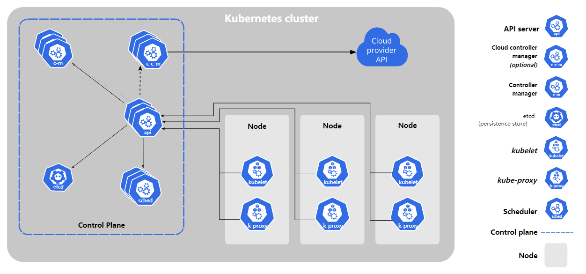

**控制平面**

* kube-apiserver
* kube-scheduler
* kube-controller-manager
* etcd
* 网络插件
  * Flannel
  * Calico
  * [https://kubernetes.io/docs/concepts/extend-kubernetes/compute-storage-net/network-plugins/](https://kubernetes.io/docs/concepts/extend-kubernetes/compute-storage-net/network-plugins/)

**数据平面**

* kubelet
  * 负责容器整体的生命周期，挂接存储。
* kube-proxy
  * 负责配置网络

**命令**

[https://kubernetes.io/docs/reference/kubectl/cheatsheet/](https://kubernetes.io/docs/reference/kubectl/cheatsheet/)

* 增删改查 kubectl create/delete/（replace or apply or edit）/get
* patch是经常性操作
* **kubectl -f 是无序列的**
  * **把所有的配置放进一个yaml**
    * 会出现先create deployment，再create ns，就会报错，放进一个yaml，按顺序
    * helm 有序的，code里写死顺序了。
  * **主动顺序apply**

**对象**

* configmap
* secret
* service account
* service
* replicaset
  ....

#### **API**

符合OpenAPI规范的 [https://kubernetes.io/zh/docs/concepts/overview/kubernetes-api/](https://kubernetes.io/zh/docs/concepts/overview/kubernetes-api/)

### 容器网络

#### 1.UDP 模式

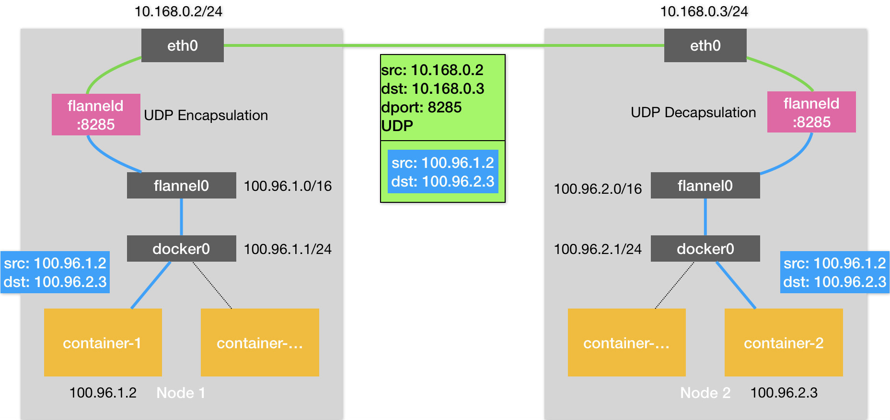

1. container-1里的进程发起的 IP 包
2. 通过容器的网关进入 docker0 网桥
3. 根据宿主机上的路由规则进入到一个叫作 flannel0 的设备中
4. flannel0 就会把这个 IP 包，交给创建这个设备的应用程序也就是 Flannel 进程
5. flanneld 看到了这个 IP 包的目的地址，把这个 IP 包直接封装在一个 UDP 包里，然后发送给 Node 2(每台宿主机上的 flanneld，都监听着一个 8285 端口，所以 flanneld 只要把 UDP 包发往 Node 2 的 8285 端口即可)
6. flanneld 会直接把这个 IP 包发送给它所管理的 TUN 设备，即 flannel0 设备。
7. Linux 内核网络栈就会负责处理这个 IP 包,通过本机的路由表来把这个 IP 包转发给 docker0 网桥。
8. docker0 网桥会扮演二层交换机的角色，将数据包发送给正确的端口，进而通过 Veth Pair 设备进入到 container-2 的 Network Namespace 里。

由于UDP 模式有严重的性能问题，所以已经被废弃了

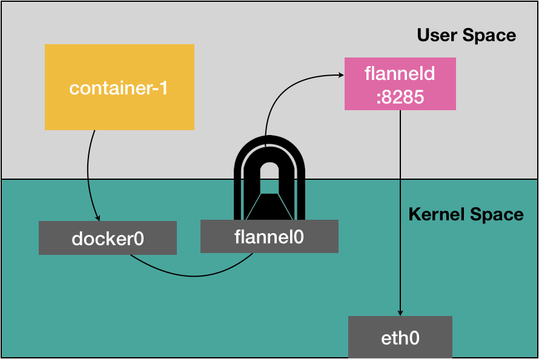

#### 2.VXLAN 模式

VXLAN，即 Virtual Extensible LAN（虚拟可扩展局域网），是 Linux 内核本身就支持的一种网络虚似化技术。所以说，VXLAN 可以完全在内核态实现上述封装和解封装的工作，从而通过与前面相似的“隧道”机制，构建出覆盖网络（Overlay Network）。

VXLAN 的覆盖网络的设计思想是：在现有的三层网络之上，“覆盖”一层虚拟的、由内核 VXLAN 模块负责维护的二层网络，使得连接在这个 VXLAN 二层网络上的“主机”（虚拟机或者容器都可以）之间，可以像在同一个局域网（LAN）里那样自由通信。当然，实际上，这些“主机”可能分布在不同的宿主机上，甚至是分布在不同的物理机房里。

而为了能够在二层网络上打通“隧道”，VXLAN 会在宿主机上设置一个特殊的网络设备作为“隧道”的两端。这个设备就叫作 VTEP，即：VXLAN Tunnel End Point（虚拟隧道端点）。

而 VTEP 设备的作用，其实跟前面的 flanneld 进程非常相似。只不过，它进行封装和解封装的对象，是二层数据帧（Ethernet frame）；而且这个工作的执行流程，全部是在内核里完成的（因为 VXLAN 本身就是 Linux 内核中的一个模块）。

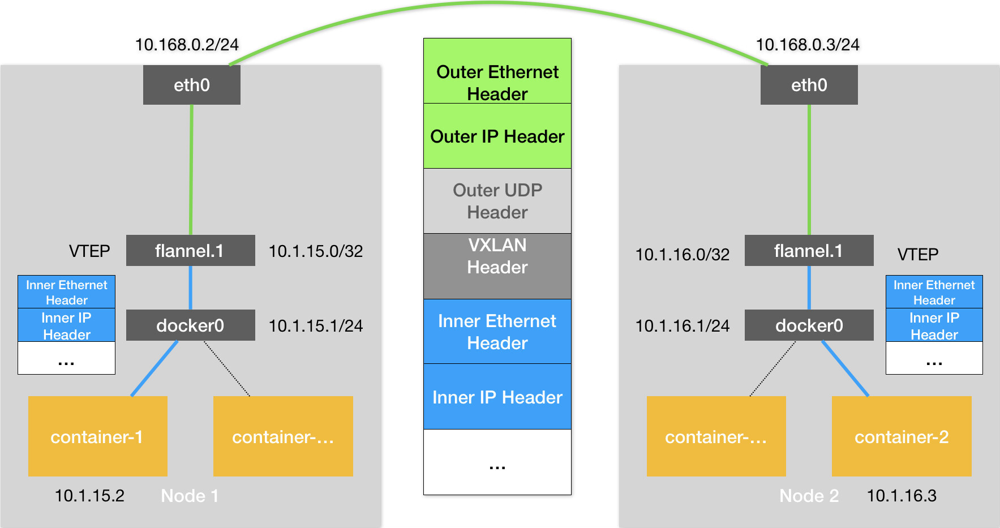

1. container-1 发出请求

2. IP 包(原始 IP 包)出现在 docker0 网桥

3. 路由到本机 flannel.1 设备

4. Linux 内核会把“目的 VTEP 设备”的 MAC 地址，填写在图中的 Inner Ethernet Header 字段，得到一个二层数据帧(内部数据帧)。

   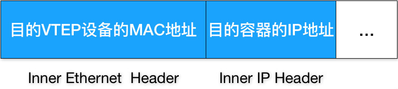

5. Linux 内核会在“内部数据帧”前面，加上一个特殊的 VXLAN 头，用来表示这个“乘客”实际上是一个 VXLAN 要使用的数据帧。

6. Linux 内核会在它前面加上一个 IP 头，即原理图中的 Outer IP Header，组成一个 IP 包。并且，在这个 IP 头里，会填上通过 FDB 查询出来的目的主机的 IP 地址

7. Linux 内核再在这个 IP 包前面加上二层数据帧头，即原理图中的 Outer Ethernet Header，并把 Node 2 的 MAC 地址填进去。这时候，我们封装出来的“外部数据帧”的格式，如下所示：

   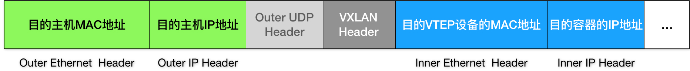

8. Node 1 上的 flannel.1 设备就可以把这个数据帧从 Node 1 的 eth0 网卡发出去。显然，这个帧会经过宿主机网络来到 Node 2 的 eth0 网卡。

9. Node 2 的内核网络栈会发现这个数据帧里有 VXLAN Header，并且 VNI=1。所以 Linux 内核会对它进行拆包，拿到里面的内部数据帧，然后根据 VNI 的值，把它交给 Node 2 上的 flannel.1 设备。

10. flannel.1 设备则会进一步拆包，取出“原始 IP 包”

11. Linux 内核网络栈就会负责处理这个 IP 包,通过本机的路由表来把这个 IP 包转发给 docker0 网桥。

12. docker0 网桥会扮演二层交换机的角色，将数据包发送给正确的端口，进而通过 Veth Pair 设备进入到 container-2 的 Network Namespace 里。

Kubernetes 是通过一个叫作 CNI 的接口，维护了一个单独的网桥来代替 docker0。这个网桥的名字就叫作：CNI 网桥，它在宿主机上的设备名称默认是：cni0。

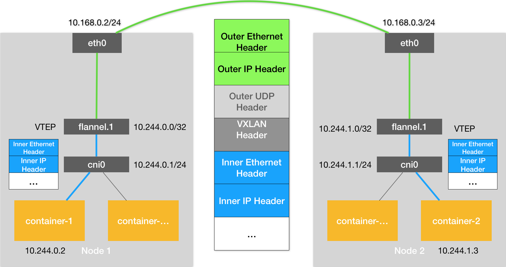

容器通信的过程就免除了额外的封包和解包带来的性能损耗。根据实际的测试，host-gw 的性能损失大约在 10% 左右，而其他所有基于 VXLAN“隧道”机制的网络方案，性能损失都在 20%~30% 左右。

#### 3.host-gw 模式

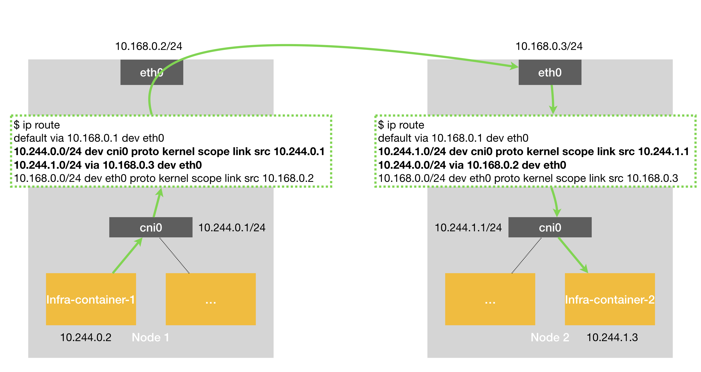

### kube-apiserver

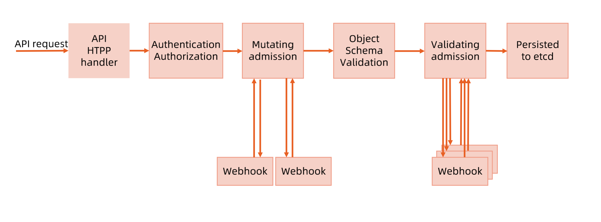

> **3A 大法**

#### 1.认证 Authentication

认证（Authentication），**识别用户身份**。认证的方式有很多，比如：HTTP base，HTTP token，TLS，Service Account，OpenID Connect 等。 

高版本的 kubernetes 默认的认证方式是 TLS。在 TLS 认证方案中，每个**用户**都拥有自己的 X.509 客户端证书，API 服务器通过配置的证书颁发机构（CA）验证客户端证书。

企业里用的认证方式：

1. AD/LDAP 方式:username，password
2. OIDC 方式，OpenID Connect，与SSO集成https://medium.com/@int128/kubectl-with-openid-connect-43120b451672
3. 基于 Service Account
4. 基于 IAMkeystone https://github.com/kubernetes/cloud-provider-openstack/blob/master/docs/keystone-auth/using-keystone-webhook-authenticator-and-authorizer.md

#### 2.鉴权 Authorization

授权（Authorization），识别是否有相应操作权利。授权者，通过组合属性（用户属性，资源属性，实体）的策略向用户授予访问权限。授权的方式也有很多，比如：AlwaysDeny、AlwaysAllow、ABAC、**RBAC**、**node** 等，高版本的 kubernetes 默认的授权方式是 RBAC 和 node。

查询用户信息，登录之后对resource的权限

#### 3.准入 Admission

准入（Admission Controller），判断你的操作是否符合集群的要求，这是一种更灵活的管控机制，用户还可以根据自己的需求定义准入插件来管理集群。kubernetes 中将准入模块分为三种，validating（验证型），mutating（修改型）以及两者兼有

[https://kubernetes.io/zh/docs/reference/access-authn-authz/admission-controllers/#%E6%AF%8F%E4%B8%AA%E5%87%86%E5%85%A5%E6%8E%A7%E5%88%B6%E5%99%A8%E7%9A%84%E4%BD%9C%E7%94%A8%E6%98%AF%E4%BB%80%E4%B9%88](https://kubernetes.io/zh/docs/reference/access-authn-authz/admission-controllers/#每个准入控制器的作用是什么)

**mutating**

我要修改请求的参数，就用mutate，比如：

- 向pod中注入sidecar https://istio.io/v1.1/help/ops/setup/injection/
- 修改pod spec中的部分字段，在label或者annotation强制加上创建pod的来源IP或者请求人
- 修改pod spec，强制限制cpu/memory request。

- ...

**validating**

- 发现image的url上不是公司内部的镜像仓库地址，deny掉
- 不允许CPU request超过10的pod spec
- ...

admission**代码**

https://github.com/kubernetes/kubernetes/tree/master/plugin/pkg/admission

**webhook**

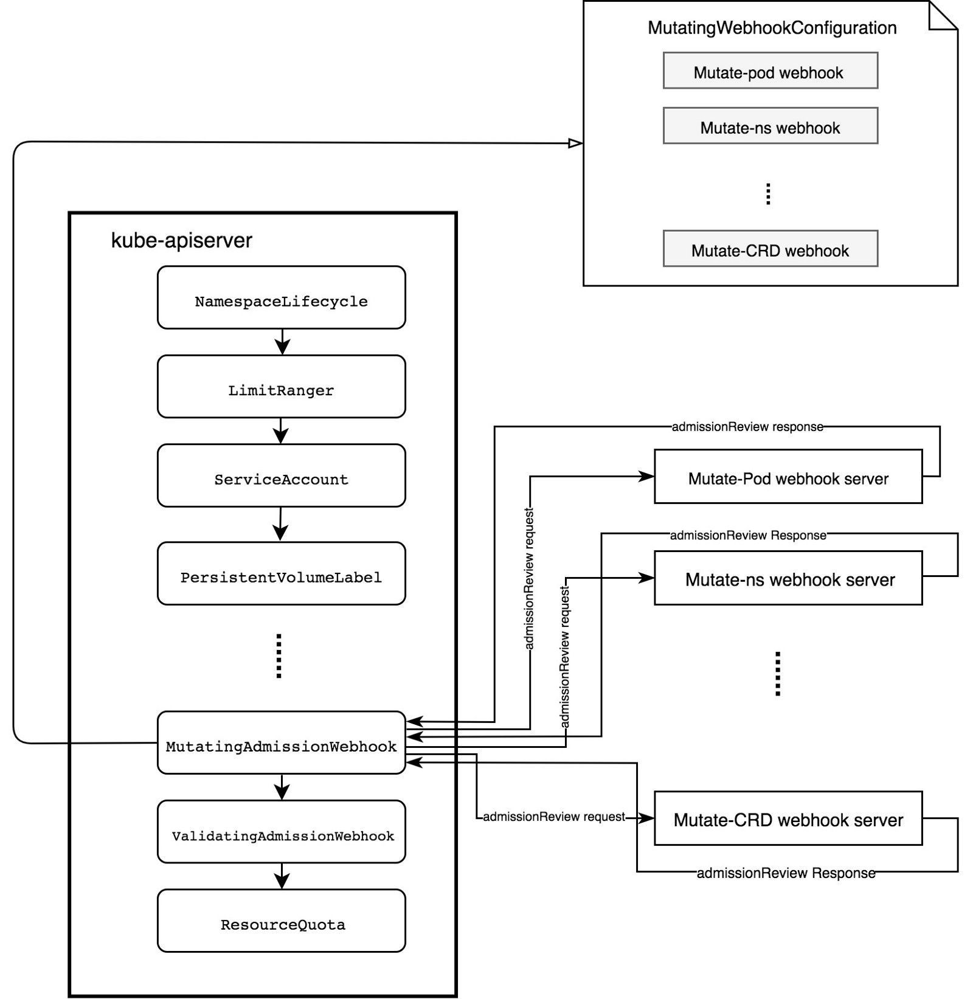

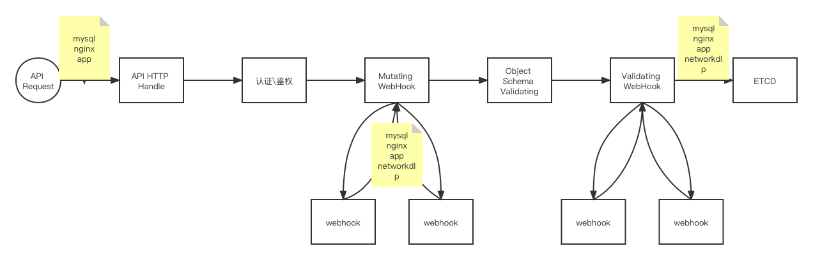

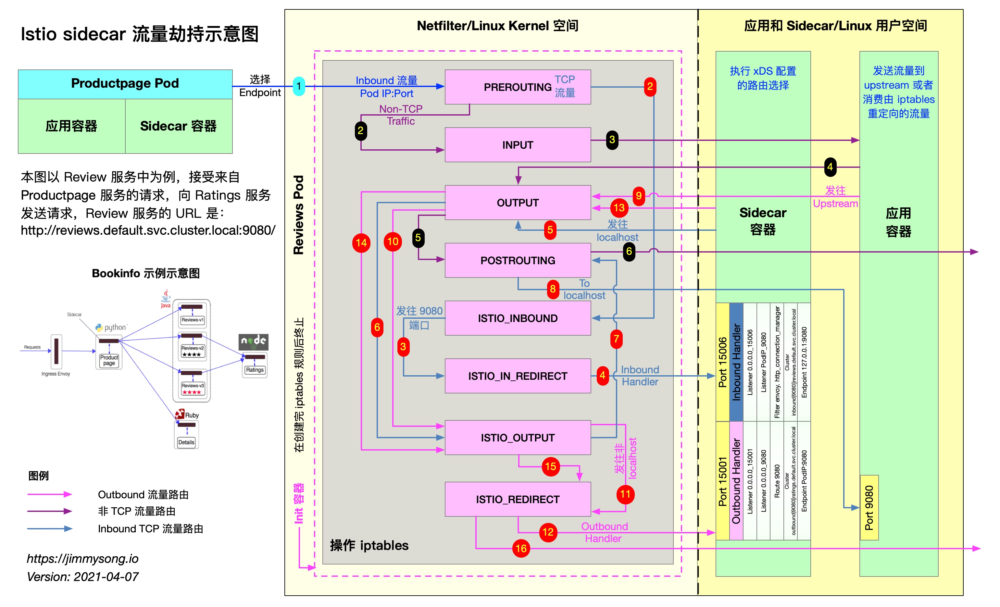
=======

